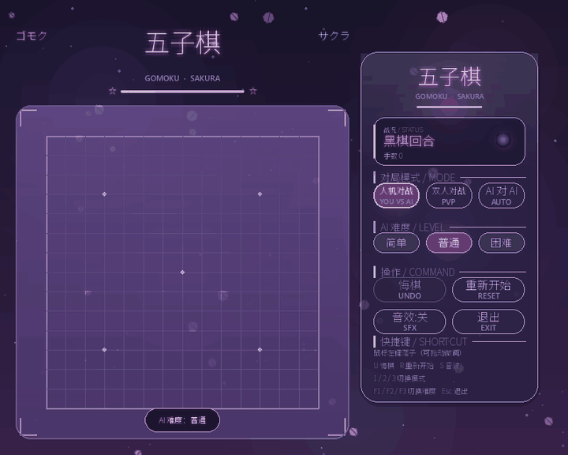
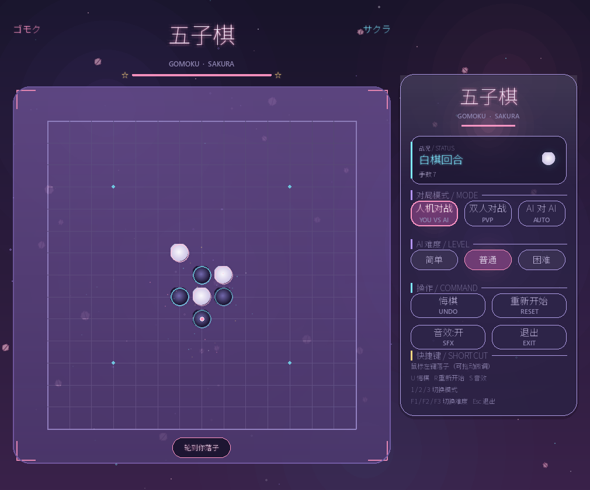
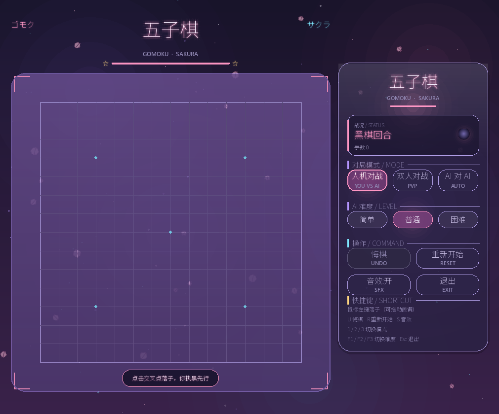
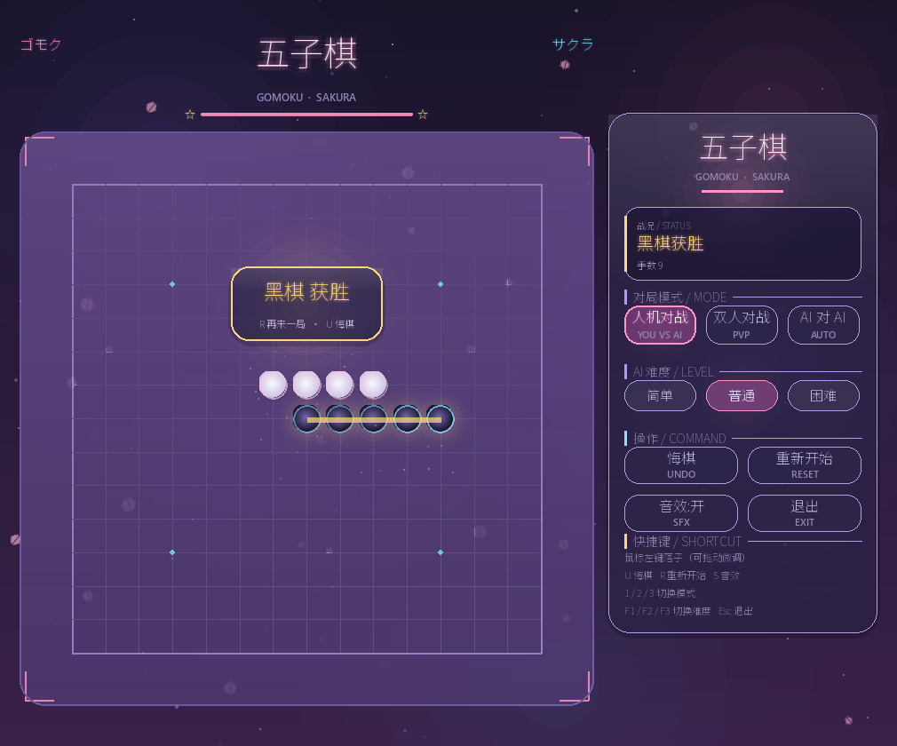

# 樱花五子棋 · Sakura Gomoku

二次元风格的 pygame 五子棋：暮色紫罗兰 + 樱花粉 + 磷光青的视觉小说式界面，
樱花飘落与星屑粒子特效，配上会算棋的电脑对手。



> 上面是真实对局的动图（21 手、黑方获胜）：樱花持续飘落，落子有弹出与星屑，
> 获胜时连线高亮并放出礼花。动图生成方式见文末。

## 运行环境

游戏只需要 **Python 3.12 + pygame 2.6.1**。推荐用 conda 建一个独立环境
（下面用 `<env>` 代指你的环境路径，例如 `%USERPROFILE%\envs\gomoku`）：

| 项目 | 值 |
| --- | --- |
| 环境名 | `gomoku` |
| Python | 3.12.14 |
| 依赖 | pygame 2.6.1（内置 SDL 2.28.4）+ 标准库 |

### 安装

```powershell
# 方式一：按 environment.yml 精确复刻（推荐）
conda env create -p <env> -f environment.yml

# 方式二：干净重建，只装游戏需要的库
conda create -p <env> python=3.12 -y
<env>\python.exe -m pip install pygame==2.6.1
```

### 启动

```powershell
<env>\python.exe run.py

# 或先激活环境
conda activate <env>
python run.py
```

### 环境配置：environment.yml

项目根目录下的 **`environment.yml`** 由 `conda env export` 导出，
记录了全部包及其精确版本与构建号，以及通过 pip 安装的 pygame：

```yaml
name: gomoku
channels:
  - defaults
dependencies:
  - python=3.12.14=hd7b1df3_0
  - pip=26.2.1=pyhc872135_0
  # …其余 conda 包…
  - pip:
      - pygame==2.6.1        # 游戏唯一需要的第三方库
```

> 本文件**已移除 `prefix:` 行**。`conda env export` 默认会把导出机器上的环境绝对路径
> 写进 `prefix:`，那既不可移植也算不上干净；重建时用
> `conda env create -p <目标环境路径> -f environment.yml` 指定路径即可。

**重新导出配置：**

```powershell
conda env export -p <env> > environment.yml
```

> **注意编码**：在 PowerShell 5.1 里直接用 `>` 重定向会把文件写成 **UTF-16LE**，
> conda 读取时会报 `'gbk' codec can't decode byte 0xff`。
> 本项目的 `environment.yml` 已存为 **UTF-8（无 BOM）**。
> 若要自己重新导出，请用下面任一种写法：
>
> ```powershell
> # 推荐：让 conda 自己写文件（shell 不参与重定向）
> cmd /c "conda env export -p <env> > environment.yml"
>
> # 或者先导出，再转成无 BOM 的 UTF-8（PowerShell 5.1 也适用）
> conda env export -p <env> > env.tmp.yml
> [IO.File]::WriteAllText("$PWD\environment.yml",
>     [IO.File]::ReadAllText("$PWD\env.tmp.yml", [Text.Encoding]::Unicode),
>     (New-Object Text.UTF8Encoding $false))
> Remove-Item env.tmp.yml
>
> # 或者用 Python 转码
> python -c "import io;p='env.tmp.yml';open('environment.yml','w',encoding='utf-8',newline='\n').write(io.open(p,encoding='utf-16').read())"
> ```

## 界面与操作



| 操作 | 说明 |
| --- | --- |
| 鼠标左键 | 在交叉点落子（按住拖动可微调落点，松开时落子） |
| `U` | 悔棋（人机模式一次撤回双方各一步） |
| `R` | 重新开始 |
| `S` | 开关音效 |
| `1` / `2` / `3` | 人机对战 / 双人对战 / AI 对 AI |
| `F1` / `F2` / `F3` | AI 难度：简单 / 普通 / 困难 |
| `Esc`、`Q` | 退出 |

- **人机对战**：你执黑先行，电脑执白。
- **双人对战**：同一台电脑轮流下棋。
- **AI 对 AI**：两个电脑自动对局。

15×15 棋盘，任意方向先连成五子（含长连）获胜；棋盘下满且无人连五判平局。

| 开局 | 黑棋获胜 |
| --- | --- |
|  |  |

## 二次元视觉设计

- **配色**：暮色紫罗兰渐变背景 + 极光斑块 + 星点层；强调色为樱花粉、磷光青、
  紫罗兰、金色。
- **棋盘**：半透明紫玻璃盘面、发光细网格、青蓝星位、四角樱花色角标。
- **棋子**：3 倍超采样径向渐变（黑子＝紫黑渐变 + 青色描边，白子＝珍珠白 + 樱花描边），
  描边亮度缓慢呼吸；落子有弹出动画与星屑迸发。
- **标题**：中文大字 + 片假名（ゴモク / サクラ）分列两侧 + 霓虹下划线 + 小星星。
- **面板**：玻璃拟态 + 发光描边；按钮带强调色、呼吸光晕与拉丁文小字副标题
  （YOU VS AI / PVP / AUTO / UNDO / RESET）。
- **特效**：樱花持续飘落（正弦摆动 + 旋转），落子与获胜迸发星屑礼花。
- **字体**：Noto Sans SC（覆盖简中与假名）+ Segoe UI Semibold（拉丁数字），
  已逐一确认字形覆盖，不会出现豆腐块。

## 布局：从机制上保证元素不重叠

这是本项目最用心、也踩坑最多的部分。

**1）按内容顺序排布，而不是写死坐标**（`layout.py` 的 `Builder`）

内容自上而下依次放入，每项记录高度与最小间距；空间不足时等比例压缩间距，
仍然放不下就直接抛错（而不是让元素悄悄叠在一起）。面板高度由内容反推，
所以窗口变高时面板居中留白，不会把按钮拉散。

**2）文字用「槽位居中」绘制**（`ui.py` 的 `slot`）

带发光的文字渲染出的 surface 会比文字本身大一圈（发光外扩），
若直接用它定位，相邻文字必然互相压住。`slot()` 用 `size_of()` 量出的真实文字尺寸定位，
把视觉中心放进槽位中心；字号超出槽宽时自动逐级缩小（下限 10~11px）。

**3）自检机制**（`tests/smoke_test.py`）

- 在 **8 种窗口尺寸**（含算出的最小窗口）下检查：按钮两两不重叠、都在面板内、
  每个按钮的文字与副标题都放得下、六个纵向区块不重叠、棋盘与面板/标题不重叠、
  面板内容不溢出。
- 反向验证：故意给一个过小的容器，确认会**抛断言**而不是静默重叠。
- 实测验证：记录**一帧内实际落位的全部文字矩形**（28 条）并检查两两不重叠，
  终局横幅与状态区也一并检查。

## 电脑棋手

`ai.py` 分两层：

1. **棋型评分**：统计每个候选点落子后在四个方向形成的连子长度与两端开放情况，
   映射为「成五 / 活四 / 冲四 / 活三 / 眠三 / 活二 …」分值，同时评估对手在该点的收益。
2. **迭代加深 α-β 搜索**：按难度搜 1~4 层，带时间预算与节点上限，超时返回当前最优解。
   搜索前先做两步检查——自己能连五就直接赢，对手能连五就必须堵。

| 难度 | 搜索深度 | 每层候选 | 时间上限 |
| --- | --- | --- | --- |
| 简单 | 1（纯启发式 + 随机扰动） | 14 | 0.35 s |
| 普通 | 2 | 8 | 1.0 s |
| 困难 | 4 | 6 | 2.0 s |

**一个关键设计**：静态评估里的「成五点」只是**威胁**，不能给成五级分值，
否则评估会被「双方都有一堆成五点」淹没，出现「为了自己做四而漏掉对手成五」的蠢棋。
所以静态评估里成五按 `THREAT_CAP` 封顶，真正的连五由搜索用 `SCORE_MATE` 表示。

## 目录结构

```
sakura-gomoku/          项目根目录
    run.py              启动脚本
    README.md           本文件
    environment.yml     环境配置（conda env export 导出，见上文）
    sakura/
        game.py         棋盘与胜负判定（纯逻辑，不依赖 pygame）
        ai.py           棋型评分 + α-β 搜索的电脑棋手
        theme.py        配色、字体、渐变/发光等绘制原语
        ui.py           自适应文字（slot / fit_size / wrap）、玻璃面板、发光按钮
        layout.py       顺序化排布 + 尺寸反推（保证不重叠）
        effects.py      樱花飘落与星屑粒子
        app.py          事件循环、主程序入口
    tests/
        smoke_test.py       规则 / AI / 布局 / 渲染（无窗口）
        interaction_test.py 合成事件驱动真实主循环
        render_shots.py     渲染各界面到 screenshots/
    screenshots/        界面截图
```

## 测试

两个套件都在 SDL dummy 驱动下运行，不弹窗：

```powershell
<env>\python.exe tests\smoke_test.py
<env>\python.exe tests\interaction_test.py
<env>\python.exe tests\render_shots.py
```

- `smoke_test.py`：棋盘规则（横/竖/双斜五连、六子长连、平局、悔棋）、
  AI 关键决策（抓制胜点、堵唯一成五点、堵活四、限制活三、双方都有机会时先赢为敬、
  `(0,0)` 制胜点不因 falsy 被误判）、10 局 AI 自我对局、布局自检、渲染与文字重叠自检。
- `interaction_test.py`：真实主循环下的人机对局、按钮与快捷键、
  非法点击（棋盘外 / 已有棋子 / AI 对局中 / 轮到电脑时）、终局后拒绝落子、
  窗口缩放与最小尺寸夹取、QUIT 退出。

## 实现要点

- **帧率**：棋盘底图、棋子、渐变、光晕全部按尺寸/颜色缓存，
  实机 1010×840 下 95+ FPS（未锁帧）。
- **音频**：落子 / 获胜 / 点击音效用正弦波加指数衰减实时合成，不依赖外部音频文件；
  没有可用音频设备时自动静音而不是崩溃。
- **字体回退**：Noto Sans SC → 微软雅黑 → 黑体 → 等线 → 游 Gothic；
  全部缺失时回退 `SysFont`，不会抛异常。

## 生成演示动图

`screenshots/demo.gif` 是真实跑出来的一局棋（黑方普通难度 ⚔ 白方简单难度，21 手黑胜），
不是手工剪辑的。生成分两步，原因是**渲染需要 pygame、写 GIF 需要 Pillow**，
两者分别在游戏环境和另一个 Python 里，拆开就不用为了做个动图给游戏环境塞额外依赖：

```powershell
# ① 渲染原始帧（用游戏环境，需要 pygame）
<env>\python.exe tests\make_gif_frames.py frames.bin 800 640 15 30

# ② 合成 GIF（需要一个装了 Pillow 的 Python）
python tests\gif_assemble.py frames.bin screenshots\demo.gif 720 128 0
```

参数依次是：`原始帧文件` `窗口宽` `窗口高` `帧率` `最多手数` / `…` `缩放宽` `颜色数` `抖动`。

两个值得记下的坑：

- **共享调色板**：GIF 默认每帧自带调色板，279 帧会白占几百 KB；改成所有帧共用一个
  自适应调色板后，体积直接掉一个数量级（21.9 MB → 1.9 MB）。
- **别开抖动**：Floyd–Steinberg 抖动的噪点会让 LZW 完全压不动
  （同样帧数下体积是关闭抖动的 10 倍以上），渐变用平色即可，肉眼几乎无感。

`tests/make_gif_frames.py` 里可以调演示对局（双方难度、随机种子）与各段停留时间；
中间对局会被自动快进，只逐手演示开局与结尾，以控制体积。
`frames.bin` 是未压缩的原始帧（约 0.4 GB），生成后可以删掉。
